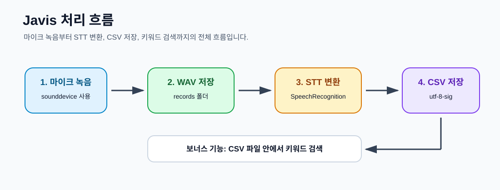
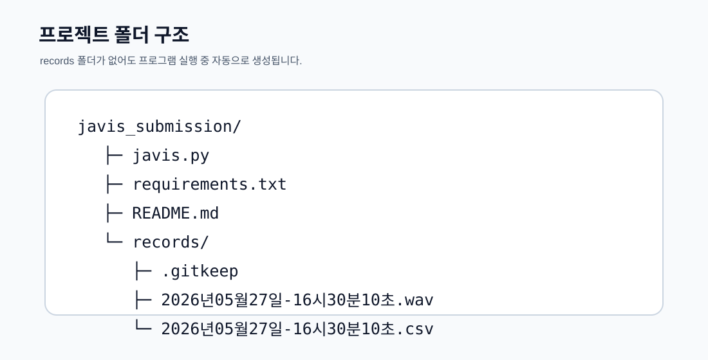

# Javis 음성 녹음 및 STT 변환 프로그램

Python을 사용하여 마이크 음성을 녹음하고, 녹음된 WAV 파일을 STT로 텍스트 변환한 뒤 CSV 파일로 저장하는 과제용 프로그램입니다.



---

## 1. 프로젝트 개요

이 프로그램은 다음 작업을 수행합니다.

1. 사용자의 마이크 입력을 녹음합니다.
2. 녹음 파일을 `records` 폴더에 `.wav` 형식으로 저장합니다.
3. 저장된 음성 파일을 STT로 텍스트 변환합니다.
4. 변환 결과를 같은 이름의 `.csv` 파일로 저장합니다.
5. 보너스 기능으로 CSV 파일 안에서 키워드를 검색합니다.

---

## 2. 주요 기능

### 2.1 마이크 녹음하기

사용자가 녹음할 시간을 초 단위로 입력하면 해당 시간만큼 마이크 입력을 녹음합니다.

녹음 파일명은 녹음 시각을 기준으로 자동 생성됩니다.

```txt
2026년05월27일-16시30분10초.wav
```

---

### 2.2 날짜 범위로 녹음 파일 보기

시작 날짜와 종료 날짜를 입력하면 해당 기간 안에 생성된 녹음 파일 목록을 확인할 수 있습니다.

입력 형식은 다음과 같습니다.

```txt
YYYY-MM-DD
```

예시입니다.

```txt
시작 날짜를 입력하세요(YYYY-MM-DD): 2026-05-01
종료 날짜를 입력하세요(YYYY-MM-DD): 2026-05-27
```

---

### 2.3 전체 음성 파일 목록 보기

`records` 폴더 안의 모든 `.wav` 파일을 확인합니다.

각 파일 옆에는 CSV 변환 여부가 함께 표시됩니다.

```txt
1. 2026년05월27일-16시30분10초.wav [CSV 생성됨]
2. 2026년05월27일-16시40분12초.wav [CSV 없음]
```

---

### 2.4 선택한 음성 파일 STT 변환하기

저장된 음성 파일 목록에서 하나를 선택하여 STT 변환을 수행합니다.

변환 결과는 같은 이름의 `.csv` 파일로 저장됩니다.

```txt
records/
├─ 2026년05월27일-16시30분10초.wav
└─ 2026년05월27일-16시30분10초.csv
```

이미 같은 이름의 CSV 파일이 존재하면 덮어쓸지 여부를 선택할 수 있습니다.

---

### 2.5 전체 음성 파일 STT 변환하기

`records` 폴더 안의 모든 `.wav` 파일을 대상으로 STT 변환을 수행합니다.

이미 CSV 파일이 있는 음성 파일은 중복 변환하지 않고 건너뜁니다.

---

### 2.6 저장된 텍스트 키워드 검색

STT 변환으로 생성된 CSV 파일 안에서 사용자가 입력한 키워드를 검색합니다.

검색어가 포함된 경우 다음 정보를 출력합니다.

```txt
CSV 파일명
음성 파일명
음성 파일내에서의 시간
인식된 텍스트
```

---

## 3. 프로그램 메뉴 화면

프로그램을 실행하면 다음과 같은 메뉴가 표시됩니다.


```txt
==== Javis 프로그램 ====
1. 마이크 녹음하기
2. 날짜 범위로 녹음 파일 보기
3. 전체 음성 파일 목록 보기
4. 선택한 음성 파일 STT 변환하기
5. 전체 음성 파일 STT 변환하기
6. 저장된 텍스트 키워드 검색
7. 종료
메뉴를 선택하세요:
```

---

## 4. 폴더 구조

프로젝트 기본 구조는 다음과 같습니다.



```txt
javis_submission/
├─ javis.py
├─ requirements.txt
├─ README.md
└─ records/
   └─ .gitkeep
```

프로그램 실행 후 녹음 파일과 CSV 파일이 생성되면 다음과 같은 구조가 됩니다.

```txt
javis_submission/
├─ javis.py
├─ requirements.txt
├─ README.md
└─ records/
   ├─ .gitkeep
   ├─ 2026년05월27일-16시30분10초.wav
   └─ 2026년05월27일-16시30분10초.csv
```

---

## 5. records 폴더 자동 생성 안내

프로그램은 실행 중 `records` 폴더가 없으면 자동으로 생성합니다.

따라서 사용자가 직접 `records` 폴더를 만들지 않아도 됩니다.

다만 GitHub는 빈 폴더를 추적하지 않기 때문에, 저장소에 `records` 폴더를 유지하려면 `records/.gitkeep` 파일을 넣어두는 것이 좋습니다.

---

## 6. 설치 방법

먼저 프로젝트 폴더로 이동합니다.

```bash
cd javis_submission
```

필요한 Python 라이브러리를 설치합니다.

```bash
python -m pip install -r requirements.txt
```

Windows에서 `python` 명령어가 동작하지 않으면 다음 명령어를 사용합니다.

```bash
py -m pip install -r requirements.txt
```

---

## 7. requirements.txt

`requirements.txt` 파일은 다음과 같이 작성합니다.

```txt
sounddevice==0.5.5
numpy
SpeechRecognition
```

각 라이브러리의 역할은 다음과 같습니다.

| 라이브러리 | 역할 |
|---|---|
| `sounddevice` | 마이크 입력을 받아 녹음 |
| `numpy` | sounddevice 내부 처리에 사용 |
| `SpeechRecognition` | 녹음된 음성 파일을 텍스트로 변환 |

---

## 8. 실행 방법

프로젝트 폴더에서 다음 명령어를 실행합니다.

```bash
python javis.py
```

Windows에서 `python` 명령어가 동작하지 않으면 다음 명령어를 사용합니다.

```bash
py javis.py
```

---

## 9. 사용 예시

### 9.1 마이크 녹음

```txt
메뉴를 선택하세요: 1
녹음할 시간을 초 단위로 입력하세요: 5
5초 동안 녹음을 시작합니다.
마이크 사용 권한 요청이 나오면 허용해 주세요.
녹음 파일을 저장했습니다: records/2026년05월27일-16시30분10초.wav
```

---

### 9.2 저장된 음성 파일 목록 확인

```txt
메뉴를 선택하세요: 3

==== 저장된 음성 파일 목록 ====
1. 2026년05월27일-16시30분10초.wav [CSV 없음]
```

---

### 9.3 선택한 음성 파일 STT 변환

```txt
메뉴를 선택하세요: 4

==== 저장된 음성 파일 목록 ====
1. 2026년05월27일-16시30분10초.wav [CSV 없음]

STT로 변환할 음성 파일 번호를 입력하세요: 1

'2026년05월27일-16시30분10초.wav' 파일의 텍스트 변환을 시작합니다.
텍스트 변환 및 CSV 저장 완료: 2026년05월27일-16시30분10초.csv
```

---

### 9.4 키워드 검색

```txt
메뉴를 선택하세요: 6
검색할 키워드를 입력하세요: 안녕하세요

==== '안녕하세요' 검색 결과 ====

CSV 파일명: 2026년05월27일-16시30분10초.csv
음성 파일명: 2026년05월27일-16시30분10초.wav
시간: 0:00
내용: 안녕하세요 테스트 녹음입니다
```

---

## 10. CSV 저장 형식

STT 변환 결과 CSV 파일은 다음 형식으로 저장됩니다.

```csv
음성 파일명,음성 파일내에서의 시간,STT 처리 시간,인식된 텍스트
2026년05월27일-16시30분10초.wav,0:00,2026-05-27 16:31:02,안녕하세요 테스트 녹음입니다
```

CSV 파일은 Microsoft Excel에서 한글이 깨지지 않도록 `utf-8-sig` 인코딩으로 저장합니다.

---

## 11. 주의사항

### 11.1 마이크 권한

처음 녹음을 실행할 때 Windows에서 마이크 권한이 필요할 수 있습니다.

마이크 권한 요청이 나오면 허용해야 정상적으로 녹음됩니다.

---

### 11.2 인터넷 연결

STT 변환은 `SpeechRecognition` 라이브러리의 Google 음성 인식 기능을 사용합니다.

따라서 음성 파일을 텍스트로 변환할 때는 인터넷 연결이 필요합니다.

---

### 11.3 음성 인식 실패

음성이 너무 작거나 주변 소음이 크거나 말소리가 불분명하면 음성 인식에 실패할 수 있습니다.

이 경우에도 프로그램은 CSV 파일을 생성하고, 인식 결과에 다음과 같은 메시지를 저장합니다.

```txt
음성을 인식하지 못했습니다.
```

---

## 12. 개발 환경

이 프로젝트는 다음 환경에서 실행하는 것을 기준으로 작성되었습니다.

```txt
Python 3.x
Windows
PowerShell 또는 Git Bash
```

---

## 13. 제출 시 포함할 파일

기본 제출 파일은 다음과 같습니다.

```txt
javis.py
requirements.txt
README.md
records/.gitkeep
```

실행 결과까지 함께 제출해야 한다면 예시 녹음 파일과 CSV 파일도 함께 포함할 수 있습니다.

```txt
records/녹음파일.wav
records/변환결과.csv
```

---

## 14. 요약

이 프로젝트는 Python 기반의 간단한 음성 처리 프로그램입니다.

녹음, 파일 저장, STT 변환, CSV 저장, 키워드 검색까지 한 흐름으로 구성되어 있어 음성 데이터를 텍스트 데이터로 정리하는 기본 과정을 확인할 수 있습니다.
